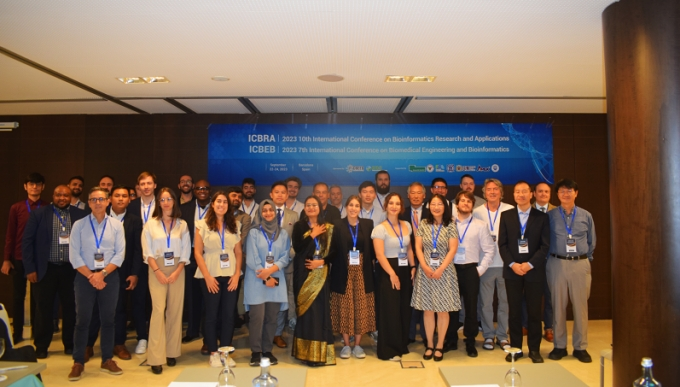

Presentation of the preliminary results of my pangenomic study about the accurate differentiation of <i>Burkholderia cepacia</i> complex species.

More information about the [event](https://icbra.org/icbra2023.html).

